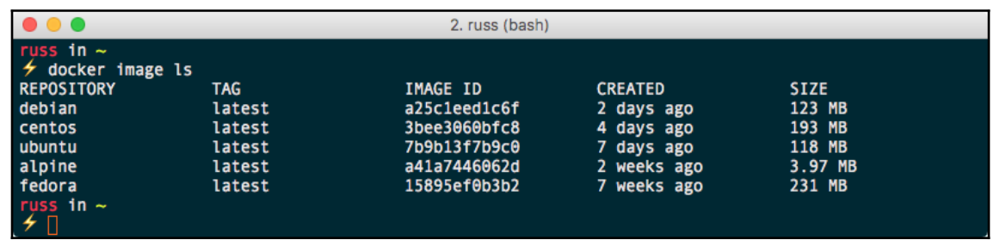

#   Building Container Images

1.  Two ways to create images
    1.  From a existing container
    2.  Dockerfile
2.  Instructions of Dockerfile
3.  Dockerfile  practice
4.  Best practices of dockerfile
5.  Other topics
    1.  docker build command
    2.  alpine image
    3.  scratch image 

---

##  Two ways of creating images

### 1. From a container

*   Commands
    ```
    docker run -it --name demo ubuntu
    apt update && apt install -y nginx
    exit
    docker commit demo demo-nginx  
    ```
*   Drawbacks
    1.  End users will not be able to easily see what is in the image they are running.
    2.  It is difficult for you to build in a good set of defaults

### 2. By dockerfile

*   Characters:
    1.  A text document
    2.  Contain a set of commands to build images

*   Dockerfile sample:
    ```docker
    FROM ubuntu
    RUN apt update && apt install -y nginx
    ```

*   Advantages:
    1.  Human readable
    2.  Version control

*   Command:
    ```
    docker build -t demo-nginx .
    ```

##  Instructions of Dockerfile

### FROM

*   Define the base image for subsequent instructions.
*   Pattern:
    ```docker
    FROM <image>[:<tag>]
    ```
*   Examples:
    ```docker
    # Default tag: latest
    FROM ubuntu
    ```
    ```docker
    FROM nginx:alpine
    ```

### LABEL

*   Add extra information of image
*   A label is a __key-value__ pair.
*   An image can have more than one label.
*   Prior to Docker 1.10, it was recommended to combine all labels into a single LABEL instruction, to prevent extra layers from being created. This is no longer necessary.
*   Pattern:
    ```docker
    LABEL <key>=<value>
    ```
*   Examples:
    ```docker
    LABEL version="1.0"
    ```

### RUN

*   Execute commands within the container at build time.
*   Create an individual layer for each of the `RUN` commands.
*   Pattern:
    1.  Shell form ( `/bin/sh -c` )
        ```docker
        RUN <command>
        ```
    2.  Exec form
        ```docker
         RUN ["executable", "param1", "param2"]
        ```
*   Examples:
    1.  Shell form
        ```docker
        RUN echo hello
        ```
    2.  Exec form
        ```docker
        RUN ["/bin/bash", "-c", "echo hello"]
        ```

### COPY & ADD

*   Copy new files or directories into the filesystem of the container
*   Support wildcards of filename
*   Pattern:
    1.  Normal cases
        ```docker
        COPY <src>... <dest>

        ADD <src>... <dest>
        ```
    2.  Paths containing whitespace
        ```docker
        COPY ["<src>"... "<dest>"]

        ADD ["<src>"... "<dest>"]
        ```
*   Examples:
    ```docker
    COPY README.txt /app/
    
    # Copy README.txt app.py into /app/ 
    COPY README.txt app.py /app/
    ```

*   Comparisons :

    |                              | COPY  | ADD   |
    | :--------------------------- | :---: | :---: |
    | Copy local files             | V     | V     |
    | Copy local files             |       | V     |
    | Auto extraction of tar files |       | V     |

### EXPOSE

*   Configure the container listens on the specified network ports at runtime.
*   This command does not map the port to the host machine.
*   The default protocol of port is `TCP`
*   Pattern:
    ```docker
    EXPOSE <port>[/<protocol>]
    ```
*   Examples:
    ```docker
    EXPOSE 80

    EXPOSE 80/udp
    ```

### ENTRYPOINT

*   Allow you to configure a container that will run as an executable.
*   Only the last `ENTRYPOINT` instruction in the Dockerfile will have an effect
*   Pattern:
    1.  Shell form
        ```docker
        ENTRYPOINT command param1 param2
        ```

    2.  Exec form
        ```docker
        ENTRYPOINT ["executable", "param1", "param2"]
        ```

*   Example:
    ```docker
    ENTRYPOINT ls
    ```

### CMD

*   The main purpose is to provide defaults for an executing container.
*   There can only be one CMD instruction in a Dockerfile.
*   If the user specifies arguments to `docker run` then they will override the default specified in `CMD`.
*   Form:
    1.  Shell form
        ```docker
        CMD command param1 param2
        ```
    
    2.  Exec form
        ```docker
        CMD ["executable","param1","param2"]
        ```

    3.  As default parameters to ENTRYPOINT
        ```docker
        CMD ["param1","param2"]
        ```
*   Example:
    ```docker
    CMD ["/bin/sh"]
    ```

### ENTRYPOINT vs. CMD

*   You can use them in conjunction with each other.

*   Cases of `nginx -g "daemon off;"`:

    1.  Case 1:
        ```docker
        ENTRYPOINT ["fping", "8.8.8.8"]
        ```
    
    2.  Case 2:
        ```docker
        ENTRYPOINT ["fping"]
        CMD ["8.8.8.8"]
        ```

    3.  Case 3:
        ```docker
        CMD ["fping", "8.8.8.8"]
        ```
*   Comparisons:

    |                                    | Case 1 | Case 2 | Case 3 |
    | :--------------------------------- | :----: | :----: | :----: |
    | Execute other commands (`/bin/sh`) |        |        | V      |
    | Exclude 8.8.8.8                    |        | V      | V      |

### USER

*   Specify the username to be used when a command is run.
*   Apply to `RUN`, `CMD` and `ENTRYPOINT` instructions.
*   Form:
    ```docker
    USER <user>[:<group>]
    ```
*   Example:
    ```docker
    USER app
    ```

### WORKDIR

*   Set the working directory for any `RUN`, `CMD`, `ENTRYPOINT`, `COPY` and `ADD` instructions that follow it in the Dockerfile.
*   If the path of `WORKDIR` doesn’t exist, it will be created.
*   Form:
    ```docker
    WORKDIR <path>
    ```
*   Example:
    ```docker
    WORKDIR /app/
    ```

### ENV

*   sets environment variables within the image both when it is built and when it is executed.
*   Form:
    ```docker
    # Single environment variable
    ENV <key> <value>

    # Multiple environment variables
    ENV <key>=<value> ...
    ```
*   Example
    ```docker
    ENV appName SecuReporter
    ENV appName=SecuReporter stage=beta
    ```

### ONBUILD

*   The instruction is executed when the image is used as the base for another build.
*   Form:
    ```docker
    ONBUILD <instruction>
    ```
    
*   Example:
    *   Golden image
        ```docker
        FROM alpine

        ONBUILD RUN apk update && apk upgrade && apk add bash
        RUN addgroup -S app && adduser -S appuser app
        ```

    *   App image
        ```docker
        FROM golden-image
        COPY app.sh /app/
        CMD ["bash", "/app/app.sh"]
        ```


##  Dockerfile practice

###  Web Page Result


###  Base image

*   [python:alpine](https://hub.docker.com/_/python/)

###  Steps

1.  Install redis
    ```
    apk add redis
    ```

2.  Install python packages (Flask & Redis) by pip
    ```
    pip install Flask Redis
    ```

3.  Copy the web python file to container

4.  Execute the "run-service.sh"
    ```
    redis-server --daemonize yes
    python app.py
    ```

##  Best Practices of dockerfile

1.  Build your images as small as possible.
    1.  Minimize the number of layers
        *   In Docker 1.10 and higher, only the instructions `RUN`, `COPY`, `ADD` create layers. 
    2.  Minimize the file size of images
        *   Don’t install unnecessary packages.
2.  Use version control for your Dockerfile.
3.  Get into the habit of using a `.dockerignore` file.
4.  Only have one Dockerfile per folder to help you organize.
5.  Execute only one application process per container

##  Other topics

### Docker build command

1.  __Command__

    1.  Build with PATH (Current directory)
        ```
        docker build .
        ```
    2.  Build with URL
        ```
        docker build github.com/creack/docker-firefox
        ```
    3.  Build with - (Without the `build context`)
        ```
        docker build - < Dockerfile
        ```

2.  __Build context__
    *   Docker Engine is a client-server application.
    *   The build process can refer to any of the files in the context.
    *   Use the `.dockerignore` file to exclude files and directories which we want to exclude.

3.  __Tag an image__
    ```
    docker build -t brian/apache:2.0 -t brian/apache .
    ```

### Alpine Linux

*   A small, independently developed, non-commercial Linux distribution.
    

*   The default image base for the official container images supplied by Docker.

### Scratch

*   The reserved and minimal image of Docker.
*   It can not pull scratch from Docker Hub.
*   For the O.S. of legacy applications.
*   Dockerfile of alpine:
    ```docker
    FROM scratch
    ADD rootfs.tar.xz /
    CMD ["/bin/sh"]
    ```

##  Reference

1.  [Processes In Containers Should Not Run As Root](https://medium.com/@mccode/processes-in-containers-should-not-run-as-root-2feae3f0df3b)